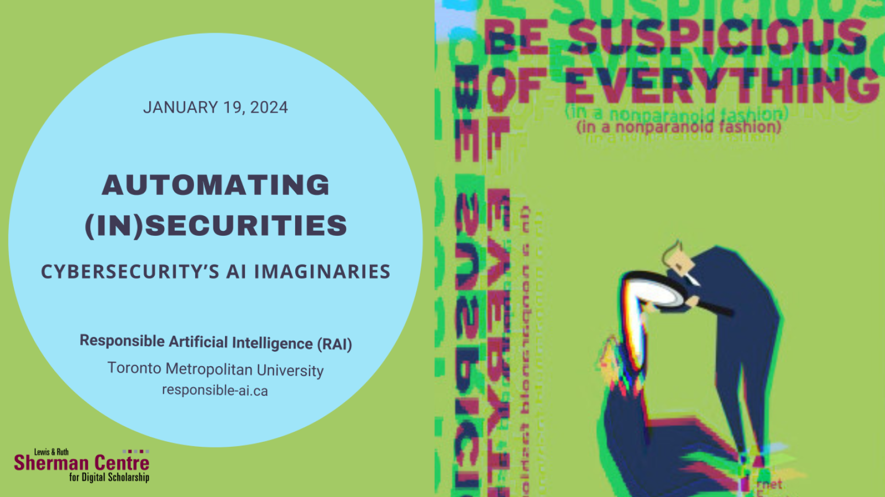

# Automating (In)securities: Cybersecurity's AI Imaginaries

Artificial intelligence has been heralded as a ‘game changer’ and ‘democratizing force’ in cybersecurity for how AI-based solutions can detect and respond to known and unknown threats in real-time with minimal human intervention. In my talk, I consider how applying generative AI to automate repetitive tasks like data collection, extraction, and basic threat search and detection can also automate a normative bias regarding what constitutes risks and threats and how to mitigate them. Cybersecurity is often presented as a set of universal measures that can be applied to protect computer systems, networks, data, and digital infrastructures. However, how cyber insecurities are understood and experienced is not universal. Risk, security, and safety are differentially applied based on factors including but not limited to race, ethnicity, religion, age, gender, sexuality, and disability. My talk examines the imaginaries generated to support advances in AI in the cybersecurity domain and the ways these epistemic claims and future visions can omit the differential vulnerabilities that contribute to insecurities in the first place.

## Event Recording

<iframe height="416" width="100%" allowfullscreen frameborder=0 src="https://echo360.ca/media/322ea792-1371-4434-9c09-3d8d16bc9554/public"></iframe>
[View original here.](https://echo360.ca/media/322ea792-1371-4434-9c09-3d8d16bc9554/public)

