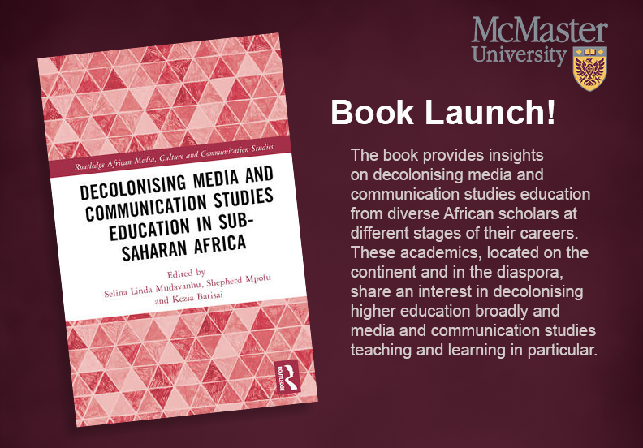
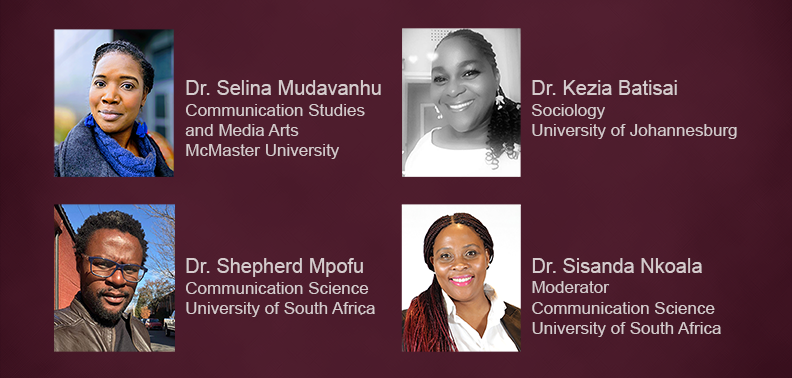

# Decolonising Media and Communication Studies Education in Sub-Saharan Africa

Please join us for a hybrid book launch and roundtable for Decolonising Media and Communication Studies Education in Sub-Saharan Africa (Routledge 2023), moderated by Dr. Sisanda Nkoala and featuring co-editors Drs. Selina Mudavanhu, Kezia Batisai and Shepherd Mpofu.

The book provides insights on decolonising media and communication studies education from diverse African scholars at different stages of their careers. These academics, located on the continent and in the diaspora, share an interest in decolonising higher education broadly and media and communication studies teaching and learning in particular.

Co-presented by the Department of Communication Studies and Media Arts and the Sherman Centre for Digital Scholarship.

## Event Recording

<iframe height="416" width="100%" allowfullscreen frameborder=0 src="https://echo360.ca/media/1f32dd30-41f1-4cf2-8d7c-a9d468ba865f/public"></iframe>
[View original here.](https://echo360.ca/media/1f32dd30-41f1-4cf2-8d7c-a9d468ba865f/public)

