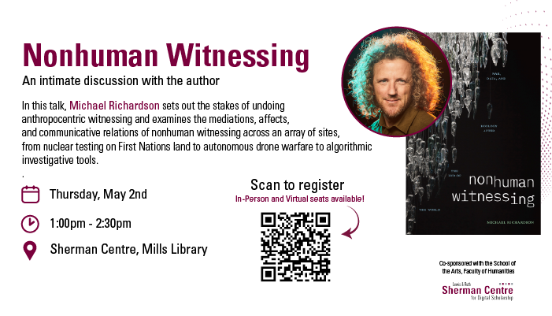

# Nonhuman Witnessing: War, Data, and Ecology After the End of the World

Dismantling the primacy of traditional human-based forms of witnessing is crucial if we are to reckon with an era of technoscientific war, ecological catastrophe, and technological capture. In his new book N*onhuman Witnessing: War, Data, and Ecology After the End of the World* (Duke 2024), Michael Richardson shows how ecological, machinic, and algorithmic forms of witnessing can help us better understand contemporary crises. In this talk, he sets out the stakes of undoing anthropocentric witnessing and examines the mediations, affects, and communicative relations of nonhuman witnessing across an array of sites, from nuclear testing on First Nations land to autonomous drone warfare to algorithmic investigative tools.

## Facilitator Bio

Michael Richardson is a writer, researcher, and teacher living and working on Gadigal and Bidjigal country. An Associate Professor at UNSW Sydney and an Associate Investigator with ADM+S, his research examines how technology, power, and culture shape knowledge in war, security, and surveillance. His latest book is *Nonhuman Witnessing: War, Climate, and Data After the End of the World* (Duke University Press, 2024).

## Event Recording

<iframe height="416" width="100%" allowfullscreen frameborder=0 src="https://echo360.ca/media/c9bd771b-4018-4324-9d1e-f90ce3836e91/public"></iframe>
[View original here.](https://echo360.ca/media/c9bd771b-4018-4324-9d1e-f90ce3836e91/public)

<!-- ## Event Slides

<embed src="assets/docs/edtechSlides.pdf" style="border:none;" width="100%" height="466px">

[Download as PDF.](assets/docs/edtechSlides.pdf) -->
